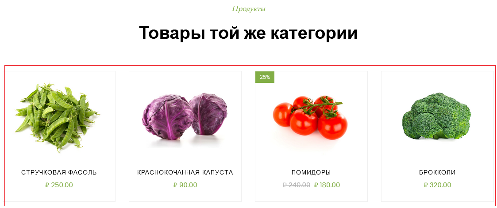
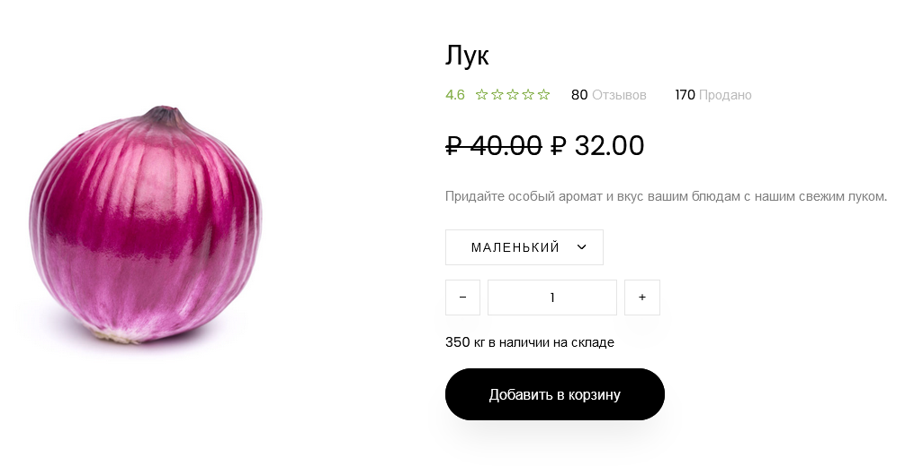

# Руководство и задания к 3-ей практике. 

На практике поработаем с маршрутами, с параметрами запросов. 
Поработаем с фильтрацией товаров и импровизированной корзиной покупок с выводом результатов как JSON.

### Раздел 1. Работа с вложенными маршрутами

#### 1.1 Вложенные маршруты для `app_store`

Ранее мы писали все маршруты в корневом файле `urls.py` (папка `project`), что может быть достаточно неудобно, особенно когда маршрутов будет много приложений, когда 
каждое приложение внутри себя обрабатывает несколько маршрутов. Пример приложение `app_store` от него в `urls.py` уже используется
2 маршрута (`'product/'` и `''`).

На практике можно в корневом `urls.py` прописывать только путь до файла с маршрутами приложения, а Django уже сам подтянет
маршруты из приложения, так структура становится более читаемая.

Для этого создадим файл `urls.py` в приложении `app_store`, где пропишем маршруты скопированные из корневого `urls.py` (в папке `project`).
Маршруты располагаются во всё той же переменной `urlpatterns` - это зарезервированная переменная в Django, в которой предполагается 
хранение маршрутов обработки представлений. 

Скопируйте данный код в `urls.py` приложения `app_store`

```python
# urls.py in app_store

from django.urls import path
from .views import product_view, shop_view

urlpatterns = [
    path('product/', product_view),
    path('', shop_view),
]
```

Далее в корневом `urls.py` необходимо поправить прошлые маршруты, для это воспользуемся функцией `include`
позволяющая указать приложение, а Django самостоятельно возьмёт маршруты из переменной `urlpatterns` приложения.

Вот как трансформируются маршруты приложения `app_store` в корневом `urls.py`

```python
path('', include('app_store.urls')),
```
А корневой `urls.py` будет выглядеть так


Теперь ссылки, что были доступны ранее для приложения `app_store` также доступны.

#### 1.2 Самостоятельно повторите для `app_weather`

Самостоятельно перепишите маршрут с использованием `include` для приложения `app_weather`,
сделайте так, чтобы тот маршрут, по которому ранее обрабатывался прогноз погоды - также обрабатывался.

Допустим если до использования `include` - прогноз погоды был доступен по адресу http://127.0.0.1:8000/weather/ ,
то после использования `include` - адрес доступа сохранился.

### Раздел 2. Работа с параметрами запроса

Получить данные из запроса, можно из переменной `request` вашей функции представления. Для этого обратитесь к переменной
`GET` объекта `request` (`request.GET`), в котором будет `словарь`, где ключи словаря - переменные в запросе, значения - значения 
переменных в запросе.

Допустим при обработке запроса `https://example.ru?q=запрос&a=ответ` из `request.GET` 
получим словарь `{'q': 'запрос', 'a': 'ответ'}`, который можно использовать для своих нужд.

#### 2.1 Обработка параметров запроса в `app_weather`

Ранее в приложении прогноза погоды, чтобы получить данные для других координат, нам нужно было менять код на сервере, 
что не всегда правильно. Теперь давайте сделаем код более гибким и будем брать значения координат для прогноза погоды из
параметров GET запроса.

Тогда во `views.py` приложения `app_weather` код представления для прогноза погоды будет следующим.

```python
from django.http import JsonResponse
from weather_api import current_weather


def weather_view(request):
    if request.method == "GET":
        lat = request.GET.get('lat')  # данные придут в виде строки
        lon = request.GET.get('lon')  # данные придут в виде строки
        if lat and lon:  # Если были переданы ключи lat и lon в параметрах запроса
            data = current_weather(lat=lat, lon=lon)  # Передаём их в функцию и получаем словарь с погодой
        else:  # Иначе получаем данные о погоде из Санкт-Петербурга
            data = current_weather(59.93, 30.31)  
        return JsonResponse(data, json_dumps_params={'ensure_ascii': False,
                                                     'indent': 4})
```

И теперь сервер будет брать данные из строки запроса и работает с ними. Допустим так
можем узнать погоду в Москве http://127.0.0.1:8000/weather?lat=55.75&lon=37.61 

А если ничего не передать, то погоду будет в Санкт-Петербурге http://127.0.0.1:8000/weather .

#### 2.2 Самостоятельно

Доработайте представление `product_view` приложения `app_store` так, чтобы через параметры запроса `id` 
представление реализовывало следующий функционал:
* Если `id` было передано в запросе и такой ключ существует в `DATABASE`, то представление возвращает характеристики товара
* Если `id` было передано в запросе и такого ключа НЕ существует в `DATABASE`, то представление возвращает 
`HttpResponseNotFound("Данного продукта нет в базе данных")`
* Если `id` НЕ было передано в запросе, то возвращает все товары.

Допишите код ниже для файла `view.py` приложения `app_store` 

```python
from django.http import HttpResponse, JsonResponse, HttpResponseNotFound
from .models import DATABASE


def product_view(request):
    if request.method == "GET":
        id_ = request.GET.get('id')
        # TODO Если id_ было передано (существует)
            # TODO Если этот id_ есть в базе (DATABASE), то вернуть JsonResponse товара (словаря с характеристиками товара)
            # TODO Иначе вернуть HttpResponseNotFound("Данного продукта нет в базе данных")

        return JsonResponse(DATABASE, json_dumps_params={'ensure_ascii': False,
                                                         'indent': 4})
```

Проверьте, что ваше представление отрабатывает все случаи:

* 'Нет продукта' - http://127.0.0.1:8000/product/?id=0

* 'Один продукт' - http://127.0.0.1:8000/product/?id=3

* 'Все продукты' - http://127.0.0.1:8000/product/

### Раздел 3. Работа с параметрами запроса через обработчик маршрутов Django

Скопируем папку `product` из папки `_labs/lab3/files` в папку `app_store`. В папке приведены HTML страницы товаров
разрабатываемого магазина. Можете открыть данные файлы в превью ли браузере и ознакомиться с данным файлом.
Если пролистать вниз в этом файле, то в разделе товары той же категории можете нажать на товары и перейти на соответствующие продукты.



Сделаем возможность отображать наши товары с использованием Django и в более информативном виде, чем JSON объект. 
Будем возвращать HTML файлы (как в прошлой работе).

Для этого во `views.py` приложения `app_store` создадим новое представление `product_page_view` (так как представление 
`product_view` у нас возвращает объект JSON)

#### 3.1 *Передача параметров с типом `slug`*

В `product_page_view` передадим параметр `page`, он будет идентификатором страницы, по этому идентификатору мы будем понимать,
что за страница нужна для отображения. Сейчас примем тот факт, что переменная `page` будет строкового типа с именем `html`
страницы которую будем отображать.

Заполните шаблон представления

```python
def product_page_view(request, page):
    if request.method == "GET":
        if isinstance(page, str):  # Проверяем, что в параметр page передали значение строкового типа
            for data in DATABASE.values():  # Перебираем все товары (словари) в DATABASE
                if data['html'] == page:  # Если значение переданного параметра совпадает именем html файла, получаемого по ключу
                    # TODO 1. Откройте файл open(f'app_store/product/{page}.html', encoding="utf-8") (Не забываем про контекстный менеджер with)
                    # TODO 2. Прочитайте его содержимое
                    # TODO 3. Верните HttpResponse c содержимым html файла

            # Если за всё время поиска не было совпадений, то значит по данному имени нет соответствующей
            # страницы товара и можно вернуть ответ с ошибкой HttpResponse(status=404)
            return HttpResponse(status=404)

        elif isinstance(page, int):
            return HttpResponse(status=404)
```

Теперь настроим обработку маршрутов

В `urls.py` приложения `app_store` пропишем маршрут с параметром `<``slug:page``>`. Обратите внимание, что
параметр `page`, что в пути, что в передаваемом параметре в представлении `product_page_view` должны обязательно называться 
одинаково.

```python
path('product/<slug:page>.html', product_page_view),
```

Можно заметить, что у нас уже есть маршрут `product/` по которому возвращается JSON с нашими товарами. Так как маршруты
у нас разные и конфликтовать не будут, так как в первом случае ожидается путь вида `product/`, а во втором
путь вида `product/samyj-luchshij-tovar.html`

`.html` в параметре стоит просто для вида, она добавляется к запросу как часть пути, допустим

`http://127.0.0.1:8000/product/onion.html` - в данном конкретном случае Django разложит адрес на составляющие и передаст
`onion` в `product_page_view` как переменную `page`. Как в данном случае `product_page_view(..., page='onion')` ну, а далее
в зависимости найдёт он в базе данных совпадение или нет, то представление вернёт соответствующий результат.

Проверим работоспособность на примере http://127.0.0.1:8000/product/onion.html 

В нашем случае это будет страница товара "Лук"



Если вдруг страница не отобразилась с CSS стилями и картинками, то не переживайте, далее это всё поправится и вызвано это тем, как 
подгружаются файлы из директорий. Это всё будет поправлено, когда будут созданы шаблоны.

Из реальных примеров типа `slug` может быть большинство интернет площадок с товарами, допустим на примере Ozon.
По данной ссылке откроется книга по Python, но нам важен не результат, что ссылка открылась, как сама ссылка

https://www.ozon.ru/product/chistyy-python-tonkosti-programmirovaniya-dlya-profi-beyder-den-211426197

Мы видим, что после  `www.ozon.ru/` далее идёт `product/`, а за ним идёт уже полезная нагрузка в виде названия и артикула(возможно).
И на примере путей Django можно было бы создать такой обработчик `'product/``<``slug:page``>``-``<``int:articul``>``'`. 
Который бы разбил адресную строку как бы нам было нужно.


#### 3.2 *Передача параметров с типом `int`*

В нашем случае магазин маленький и можно облегчить задачу и получать страницу товара не только по имени товара, 
но и по его `id` в базе данных.

Здесь нам поможет параметр `int`. Создадим маршрут в `urls.py` приложения `app_store`

```python
path('product/<int:page>', product_page_view),
```

Вы не ошиблись, мы создали 2 различных маршрута (один с `slug` другой с `int`) и привязали к одному представлению. Данный
подход имеет место на практике, но тогда представление должно поддерживать данную вариацию
типа `slug` и типа `int` который может прийти в переменной `page` функции `product_page_view`

Допишите `product_page_view` следующим кодом:

```python
def product_page_view(request, page):
    if request.method == "GET":
        if isinstance(page, str): # Ветка для обработки типа slug
            # TODO Ваш код для обработки slug в product_page_view
        
        elif isinstance(page, int): # Ветка для обработки типа int
            data = DATABASE.get(str(page))  # Получаем какой странице соответствует данный id
            if data:  # Если по данному page было найдено значение
                with open(f'app_store/product/{data["html"]}.html', encoding="utf-8") as f: # Определяем название файла для открытия
                    return HttpResponse(f.read())
        
        return HttpResponse(status=404)

```

Теперь можно обратиться по адресу http://127.0.0.1:8000/product/9 , который вернет товар "Лук"

### Раздел 4. Фильтрация продуктов

Если зайти на главную страницу, http://127.0.0.1:8000/ , то можно увидеть разделы для групп товаров.


Нашей текущей задачей будет реализовать фильтрацию, но реализуем мы её со стороны сервера, а визуальной реализацией займемся на следующей практике.

Скопируйте папку `logic` из `_labs/lab3/files` в корне проекта. 

В скопированной папке `logic` содержится файл `services.py` в нём мы будем дописывать скрипты обработки данных.

> В файле `services.py` необходимо дописать функцию `filtering_category` которая будет возвращать список товаров (список словарей с параметрами товаров)
выполняющие условия фильтрации. В блоке `if __name__ == "__main__"` приведен тестирующий пример, 
для проверки правильности работы.

Копировать приведенный ниже код не нужно, он есть в `services.py`. Код дан для визуального представления, что требуется

```python
def filtering_category(database: dict[str, dict],
                       category_key: [None, str] = None,
                       ordering_key: [None, str] = None,
                       reverse: bool = False):
    """
    Функция фильтрации данных по параметрам

    :param database: База данных товаров. (словарь словарей. При проверке в качестве database будет передаваться словарь DATABASE из models.py)
    :param category_key: [Опционально] Ключ для группировки категории. Если нет ключа, то рассматриваются все товары.
    :param ordering_key: [Опционально] Ключ по которому будет произведена сортировка результата.
    :param reverse: [Опционально] Выбор направления сортировки:
        False - сортировка по возрастанию;
        True - сортировка по убыванию.
    :return: list[dict] список товаров с их характеристиками, попавших под условия фильтрации. Если нет таких элементов,
    то возвращается пустой список
    """
    if category_key is not None:
        result = ...  # TODO При помощи фильтрации в list comprehension профильтруйте товары по категории (ключ 'category') в продукте database. Или можете использовать
        # обычный цикл или функцию filter. Допустим фильтрацию в list comprehension можно сделать по следующему шаблону
        # [product for product in database.values() if ...] подумать, что за фильтрующее условие можно применить.
        # Сравните значение категории продукта со значением category_key
    else:
        result = ...  # TODO Трансформируйте словарь словарей database в список словарей
        # В итоге должен быть [dict, dict, dict, ...], где dict - словарь продукта из database
    if ordering_key is not None:
        ...  # TODO Проведите сортировку result по ordering_key и параметру reverse
        # Так как result будет списком, то можно применить метод sort, но нужно определиться с тем по какому элементу сортируем и в каком направлении
        # result.sort(key=lambda ..., reverse=reverse)
        # Вспомните как можно сортировать по значениям словаря при помощи lambda функции
    return result


if __name__ == "__main__":
    from app_store.models import DATABASE

    test = [
        {'name': 'Клубника', 'discount': None, 'price_before': 500.0,
         'price_after': 500.0,
         'description': 'Сладкая и ароматная клубника, полная витаминов, чтобы сделать ваш день ярче.',
         'rating': 5.0, 'review': 200, 'sold_value': 700,
         'weight_in_stock': 400,
         'category': 'Фрукты', 'id': 2, 'url': 'app_store/images/product-2.jpg',
         'html': 'strawberry'},

        {'name': 'Яблоки', 'discount': None, 'price_before': 130.0,
         'price_after': 130.0,
         'description': 'Сочные и сладкие яблоки - идеальная закуска для здорового перекуса.',
         'rating': 4.7, 'review': 30, 'sold_value': 70, 'weight_in_stock': 200,
         'category': 'Фрукты', 'id': 10, 'url': 'app_store/images/product-10.jpg',
         'html': 'apple'}
    ]
    # Проверяем корректность выполнения функции
    print('Проверка фильтрации: ', filtering_category(DATABASE, 'Фрукты', 'price_after', True) == test)  # True

```

Далее допишем представление `product_view` во `views.py` приложения `app_store`.

Во `views.py` приложения `app_store` импортируйте `filtering_category` из `logic.services`

Ниже приведена заготовка с разветвлениями, которую необходимо заполнить для корректной работы. В целом необходимо правильно
прописать значения в переменной `data` в ветке `if category_key := request.GET.get("category"):`. 
Ветку `if id_ := request.GET.get("id"):` вы уже реализовывали ранее.

Внимательно проверьте правильно ли вы работаете с условиями. Так как в обработчике `product_view` сначала проверяется
есть ли параметр `id` в адресной строке, а только затем (если `id` нет в адресной строке среди переданных 
пользователем параметров) вы проверяете параметры category, ordering и reverse. Обратите внимание, чтобы 
`HttpResponseNotFound("Данного продукта нет в базе данных")` написанный вами ранее корректно отрабатывался.

```python
from logic.services import filtering_category  # Импортируем filtering_category

def product_view(request):
    if request.method == "GET":
        # Обработка id из параметров запроса (уже было реализовано ранее)
        id_ = request.GET.get('id')
        if id_:
            if id_ in DATABASE:
                return JsonResponse(DATABASE[id_], json_dumps_params={'ensure_ascii': False,
                                                                      'indent': 4})
            return HttpResponseNotFound("Данного продукта нет в базе данных")

        # Обработка фильтрации из параметров запроса
        category_key = request.GET.get("category")  # Считали 'category' 
        if ordering_key := request.GET.get("ordering"): # Если в параметрах есть 'ordering'
            reverse = request.GET.get("reverse")
            if reverse and reverse.lower() == 'true':  # Если в параметрах есть 'ordering' и 'reverse'=True
                data = ... #  TODO Использовать filtering_category и провести фильтрацию с параметрами category, ordering, reverse=True  
            else:  # Если не обнаружили в адресно строке ...&reverse=true , значит reverse=False
                data = ... #  TODO Использовать filtering_category и провести фильтрацию с параметрами category, ordering, reverse=False
        else:
            data = ... #  TODO Использовать filtering_category и провести фильтрацию с параметрами category
        # В этот раз добавляем параметр safe=False, для корректного отображения списка в JSON
        return JsonResponse(data, safe=False, json_dumps_params={'ensure_ascii': False,
                                                                 'indent': 4})
```

Проверьте работу вашего представления:

* http://127.0.0.1:8000/product?category=Фрукты&ordering=price_after&reverse=True


* http://127.0.0.1:8000/product?category=Фрукты&ordering=price_after


* http://127.0.0.1:8000/product?category=Овощи


* http://127.0.0.1:8000/product


* http://127.0.0.1:8000/product/?id=10

Можете самостоятельно придумать параметры для фильтрации, допустим:

* Можете вывести все продукты в порядке убывания рейтинга продукта

### Раздел 5. Работа с корзиной товаров

Товары есть, фильтрация есть, можно даже каждый товар открыть посмотреть на него. 

Настало время добавить товар в корзину!

Однако мы с вами снова пойдём реализации со стороны серверной части, а отображение в HTML оставим на следующую практику.

В отличии, от корзины - база данных наших товаров не меняется со временем. В корзину как добавляют товары, 
так и удаляют из нёё. 

Желательно чтобы от перезапуска сервера наша корзина не приходила в начальное состояние(пустая),
а сохраняла то, что мы туда положили ранее.

Поэтому в этот раз воспользуемся файлом в виде базы данных в которой будем хранить нашу информацию. Хранить 
информацию будем в файле `cart.json`.

В файле `services.py` напишем функции `view_in_cart`, `add_to_cart`, `remove_from_cart`  которые реализуют действия по
просмотру, добавлению и удалению товаров из корзины. 

Функция `view_in_cart` уже реализована, необходимо дописать 
`add_to_cart`, `remove_from_cart`

```python
import json
import os
from store.models import DATABASE

# def filtering_category(...)  Ваша реализация filtering_category 

def view_in_cart() -> dict:  # Уже реализовано, не нужно здесь ничего писать
    """
    Просматривает содержимое cart.json

    :return: Содержимое 'cart.json'
    """
    if os.path.exists('cart.json'):  # Если файл существует
        with open('cart.json', encoding='utf-8') as f:
            return json.load(f)

    cart = {'products': {}}  # Создаём пустую корзину
    with open('cart.json', mode='x', encoding='utf-8') as f:   # Создаём файл и записываем туда пустую корзину
        json.dump(cart, f)

    return cart


def add_to_cart(id_product: str) -> bool:
    """
    Добавляет продукт в корзину. Если в корзине нет данного продукта, то добавляет его с количеством равное 1.
    Если в корзине есть такой продукт, то добавляет количеству данного продукта + 1.

    :param id_product: Идентификационный номер продукта в виде строки.
    :return: Возвращает True в случае успешного добавления, а False в случае неуспешного добавления(товара по id_product
    не существует).
    """
    cart = ...  # TODO Помните, что у вас есть уже реализация просмотра корзины,
    # поэтому, чтобы загрузить данные из корзины, не нужно заново писать код.
    
    # ! Обратите внимание, что в переменной cart находится словарь с ключом products.
    # ! Именно в cart["products"] лежит словарь гдк по id продуктов можно получить число продуктов в корзине.
    # ! Т.е. чтобы обратиться к продукту с id_product = "1" в переменной cart нужно вызвать
    # ! cart["products"][id_product]
    # ! Далее уже сами решайте как и в какой последовательности дальше действовать. 
    
    # TODO Проверьте, а существует ли такой товар в корзине, если нет, то перед тем как его добавить - проверьте есть ли такой id_product товара в вашей базе данных DATABASE, чтобы уберечь себя от добавления несуществующего товара.

    # TODO Если товар существует, то увеличиваем его количество на 1

    # TODO Не забываем записать обновленные данные cart в 'cart.json'. Так как именно из этого файла мы считываем данные и если мы не запишем изменения, то считать измененные данные не получится.

    return True


def remove_from_cart(id_product: str) -> bool:
    """
    Добавляет позицию продукта из корзины. Если в корзине есть такой продукт, то удаляется ключ в словаре
    с этим продуктом.

    :param id_product: Идентификационный номер продукта в виде строки.
    :return: Возвращает True в случае успешного удаления, а False в случае неуспешного удаления(товара по id_product
    не существует).
    """
    cart = ...  # TODO Помните, что у вас есть уже реализация просмотра корзины,
    # поэтому, чтобы загрузить данные из корзины, не нужно заново писать код.
    
    # С переменной cart функции remove_from_cart ситуация аналогичная, что с cart функции add_to_cart
    
    # TODO Проверьте, а существует ли такой товар в корзине, если нет, то возвращаем False.

    # TODO Если существует товар, то удаляем ключ 'id_product' у cart['products'].

    # TODO Не забываем записать обновленные данные cart в 'cart.json'

    return True


if __name__ == "__main__":
    # Проверка работоспособности функций view_in_cart, add_to_cart, remove_from_cart
    # Для совпадения выходных значений перед запуском скрипта удаляйте появляющийся файл 'cart.json' в папке
    print(view_in_cart())  # {'products': {}}
    print(add_to_cart('1'))  # True
    print(add_to_cart('0'))  # False
    print(add_to_cart('1'))  # True
    print(add_to_cart('2'))  # True
    print(view_in_cart())  # {'products': {'1': 2, '2': 1}}
    print(remove_from_cart('0'))  # False
    print(remove_from_cart('1'))  # True
    print(view_in_cart())  # {'products': {'2': 1}}

    # Предыдущий код, что был для проверки filtering_category закомментируйте
```

Финалом практики будет составление представления, которое будет обрабатывать запросы и работать с `cart.json`

Какие представления нам нужны? Те, что будут обрабатывать 3 функции, поэтому создадим 3 представления во `views.py` 
приложения `app_store`. 

* `cart_view` - возвращает JSON с корзиной


* `cart_add_view` - добавляет в корзину товар по его `id_product`


* `cart_del_view` - удаляет товар из корзины по его `id_product`

Используйте и заполните предложенный шаблон

```python
from logic.services import view_in_cart, add_to_cart, remove_from_cart


def cart_view(request):
    if request.method == "GET":
        data = ... # TODO Вызвать ответственную за это действие функцию
        return JsonResponse(data, json_dumps_params={'ensure_ascii': False,
                                                     'indent': 4})


def cart_add_view(request, id_product):
    if request.method == "GET":
        result = ... # TODO Вызвать ответственную за это действие функцию и передать необходимые параметры
        if result:
            return JsonResponse({"answer": "Продукт успешно добавлен в корзину"},
                                json_dumps_params={'ensure_ascii': False})

        return JsonResponse({"answer": "Неудачное добавление в корзину"},
                            status=404,
                            json_dumps_params={'ensure_ascii': False})


def cart_del_view(request, id_product):
    if request.method == "GET":
        result = ... # TODO Вызвать ответственную за это действие функцию и передать необходимые параметры
        if result:
            return JsonResponse({"answer": "Продукт успешно удалён из корзины"},
                                json_dumps_params={'ensure_ascii': False})

        return JsonResponse({"answer": "Неудачное удаление из корзины"},
                            status=404,
                            json_dumps_params={'ensure_ascii': False})
```

Осталось только прописать маршруты в `urls.py` приложения `app_store`. Строковый тип `id_product` передаём за счет `str`

```python
    path('cart/', cart_view),
    path('cart/add/<str:id_product>', cart_add_view),
    path('cart/del/<str:id_product>', cart_del_view),
```

Протестируйте правильность выполнения запросов.

# Практика окончена

Зафиксируем изменения сделав коммит и отправим эти коммиты на github