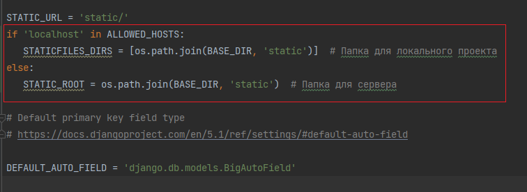
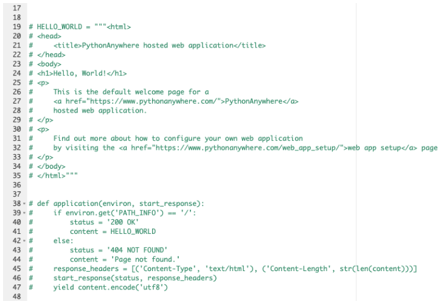
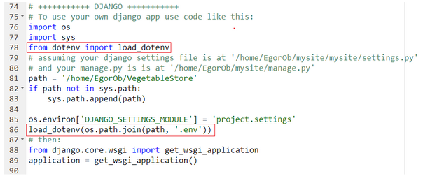

# Деплой

### 1. Подготовка. Скрываем всю чувствительную информацию

1. Устанавливаем модуль `python-dotenv` - пакет для работы удобной работы с переменными среды

```
pip install python-dotenv
```

2. Cоздайте файл `template.env` (добавьте его в систему контроля версий) в корне проекта, где будем хранить переменные окружения. 
Этот файл не будет содержать самих значений, а только названия переменных.

```env
SECRET_KEY=
DEBUG=
ALLOWED_HOSTS=
```


3. Создайте файл `.env` (`не добавляйте его в систему контроля версий`) по тем же ключам добавьте значения

```python
SECRET_KEY=<ваши значения>
DEBUG=true
ALLOWED_HOSTS='localhost,127.0.0.1'
```


`SECRET_KEY` получаем из соответствующих переменных файла `settings.py`

4. В файле `settings.py` (папка project) выполняем загрузку переменных среды из файла `.env` с помощью 
установленного пакета, также в `settings.py` на нужных местах необходимо выгрузить 
значения из окружения:


```python
# settings.py
import os
from dotenv import load_dotenv

load_dotenv()  # здесь загружаются данные из .env и отправляются в переменные окружения

SECRET_KEY = os.getenv('SECRET_KEY')

DEBUG = os.getenv('DEBUG') == 'true'

ALLOWED_HOSTS = [host.strip() for host in os.getenv('ALLOWED_HOSTS').split(',')]
```


5. В корневой `.gitignore` добавьте `.env`, чтобы на `github` не залилась чувствительная информация.


6. Затем в `settings.py` рядом со `STATIC_URL = 'static/'` пропишите (долистайте до самого конца `settings.py`)

```python
STATIC_URL = "static/"  # Папка в корне проекта, где будут собираться статические файлы
if 'localhost' in ALLOWED_HOSTS:
   STATICFILES_DIRS = [os.path.join(BASE_DIR, 'static')]  # Папка для локального проекта
else:
   STATIC_ROOT = os.path.join(BASE_DIR, 'static')  # Папка для сервера
```



> Используя параметр `STATICFILES_DIRS` вы можете указать, где Django будет искать статические файлы помимо папки `static` в каждом приложении

> Конструкция if - else поможет в будущем и работать на сервере и на локальном проекте.
Так как параметр `STATICFILES_DIRS` нужен в режиме работы с локальным проектом (если вы решите собрать 
все статические файлы в одну корневую папку static, но даже если она указана, но её нет физически, 
то никакой ошибки не будет), 
а `STATIC_ROOT` с сервером (на сервере чаще всего присутствует условие, что вся статика должна быть в отдельной корневой папке static). 
Одновременно `STATICFILES_DIRS` и `STATIC_ROOT` не могут существовать в одном файле

> `STATICFILES_DIRS` и `STATIC_ROOT` в Django выполняют разные функции.

> * `STATICFILES_DIRS`: Это список папок, в которых Django 
ищет статические файлы при выполнении команды collectstatic или при 
использовании runserver в режиме отладки. Обычно используется для файлов,
которые изменяются в процессе разработки.

> * `STATIC_ROOT`: Это путь к папке, в которую собираются (копируются) 
все статические файлы из приложений Django при выполнении команды 
collectstatic. Эта папка используется для предоставления статических 
файлов в production, когда ваш веб-сервер отдает файлы напрямую, а не 
через Django.

7. Перезапустите сервер и проверьте, что переменные окружения правильно подтянулись и всё работоспособно.

> Не обращайте внимание на предупреждение в терминале, на текущий момент это нормально, главное, чтобы картинки в приложении отображались,
при заходе на сайт.


8. Обновите файл `requirements.txt`, чтобы внести в него новые модули и была возможность восстановить окружение

```
pip freeze > requirements.txt
```

9. Сделайте коммит ваших изменений
> Проверьте, чтобы в коммите не было файла `.env`

И отправьте всё на сервер github. 

## 2. Деплой на сервис pythonanywhere

Зарегистрируйтесь на https://www.pythonanywhere.com/

Создайте Web приложение нажав `“Add a new app”`


Ваш бесплатный домен, по которому вы можете получать доступ к вашему приложению. 
Сохраните название этого домена, он понадобится чуть позже. Нажимаем Next


Выбираем “Manual configuration”.


Чтобы избежать непредвиденных ситуаций при развертывании выберите ту версию интерпретатора, которая была у вас на локальной машине.
На текущий момент сервис ограничен python 3.10, поэтому если использовали python 3.11 и 3.12, то в теории проблем не должно быть
если выберете 3.10.


Нажимаем Next и ждем пока создастся приложение


В `pythonanywhere` выбираем `Consoles` и `Bash`


Перед вами откроется консоль, через которую вы сможете настроить удаленный сервер и загрузить туда ваш Django проект


Далее необходимо склонировать `Ваш репозиторий` с github, что недавно пушили. 
Возьмём ссылку с вашего репозитория

> Картинка ниже как пример (копируем свою ссылку)


А затем с помощью команды загрузим проект на сервер:

```
git clone <url вашего репозитория>
```

Как пример `git clone https://github.com/EgorOb/pythonPy110_part2_dev.git`


С помощью команды `ls` убедимся что в директории существует папка с названием нашего проекта и перейдём в нее с помощью команды

```
cd <название вашего репозитория>
```


Далее нужно настроить виртуальное окружение, чтобы установить все зависимости, которые были установлены на вашей локальной машине. Создать виртуальное окружение можно с помощью команды

```python
python -m venv <название виртульного окружения>
```

Создание окружения может занимать значительное время (на примере окружения с названием venv)


Теперь следует активировать виртуальное окружение с помощью следующей команды

```
source <название виртуального окружения>/bin/activate
```


Установим все зависимости из файла `requirements.txt`

```
pip install -r requirements.txt
```

Далее создайте файл `.env` и заполните его необходимыми данными:

```
cp template.env .env
```

Любым удобным способом заполнить файл .env на удаленной машине (например, через графический интерфейс) Files -> <папка с вашим проектом> -> .env

>(Не обращаем внимания на название проекта, это пример)


Скопируйте данные из вашего локального .env (все ключи) в .env на сервере 


> Обратите внимание, SECRET_KEY как на локальной машине, ALLOWED_HOSTS согласно вашему домену, 
полученному на шаге, когда просили сохранить адрес (если вдруг не сохранили этот адрес, то он есть на вкладке Web)

Зеленая кнопка, чтобы сохранить результат


Возвращаемся в консоль и прописываем команду для сбора всех статических файлов в одном месте (это условие сервера)

```python 
python manage.py collectstatic
```


Подготовка среды закончена теперь, нужно настроить приложение. Переходим во вкладку Web


Находим блок “Code”, настраиваем папку с исходным кодом вашего проекта и рабочей директорией. Не обращаем внимание, что написано VegetableStore, это прошлый проект, в вашем случае будет папка с которой работаете на сервере 
(будет называться как ваш репозиторий)


Далее нужно настроить “WSGI configuration file”: нажимаем на синюю ссылку


В wsgi файле комментируем (работает комбинация Ctrl+/) 19-47 строки



Раскомментируем 76-89 строки отвечающие за wsgi для Django


Далее нужно настроить путь до файлов с настройками вашего приложения (файл settings.py) и файла, который управляет вашим приложением (manage.py). Переменная path должна быть равна пути до вашего проекта

Было


Стало


Переменная окружения на ваш модуль с настройками проекта должна быть изменена в соответствии с названием вашего проекта. Подсмотреть её значение можно в файле wsgi.py вашего Django проекта


Было


Стало


Также нужно подгрузить переменные среды, находящиеся в файле .env

```python
from dotenv import load_dotenv

load_dotenv(os.path.join(path, '.env'))
```



Сохраняем файл. Кнопка Save


Настраиваем путь до вашего виртуального окружения во вкладке Web

`<путь до проекта>/<названием виртуального окружения>`


Во вкладке Web настраиваем раздел “Static files”:

* URL = STATIC_URL из settings.py

* Directory = <путь до проекта>/<название папки со статическими файлами>


В данном сервисе проблематично указывать статические файлы для каждого приложения, придётся делать это вручную. 
Выход вынести все статические файлы в одну папку, что мы и сделали при вынесении папки со статическими файлами в корень проекта (collectstatic)

Перезапускаем приложение (зеленая кнопка, нужно будет подождать определенное время) и переходим по ссылке выше (доменное имя)


В результате, если всё сделано верно теперь на сервисе развернуто приложение с аналогичным функционалом как на локальной машине и можно будет его проверить через любой браузер по вашему доменному имени.

Теперь по адресной ссылке, на сайт можно зайти с любого устройства поддерживающее интернет соединение.


Обычно на практике никто не сохраняет БД на github, 
так как базы данных не должны также храниться в открытом месте, но в качестве упрощения себе жизни в .gitignore 
не стоит строчка с игнорированием базы данных Django (которая по умолчанию SQLite). 

___

> Если база не перенеслась или поставили игнорирование базы в .gitignore, то необходимо создать таблицы в БД
командой в консоле сервиса (обратите внимание, что в консоле должно быть активировано виртуальное окружение)

```python
python manage.py migrate
```
