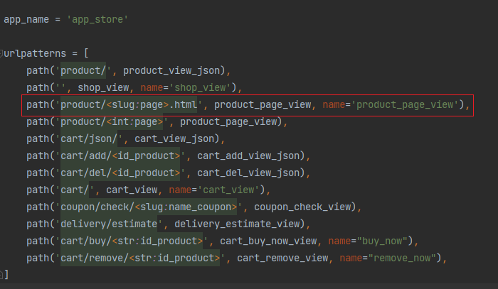
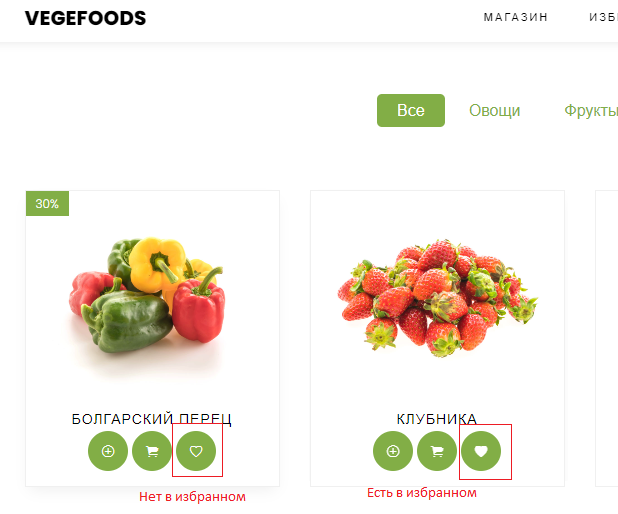

# Зачётное задание

В зачётном задании будет необходимо реализовать функционал избранного по приведенному шаблону.

Шаблон `wishlist.html` приведён в `_labs/lab6_exam/files`

На базе того, что вы сделали ранее, теперь самостоятельно предстоит разработать функционал избранного. 

Будут приведены шаблоны, которые необходимо заполнить. Также будет приведен порядок действий.


### Этап 1. Создайте новое приложение app_wishlist

Создайте приложение `app_wishlist`, вспомните команду для этого.

Помните, что приложение необходимо будет зарегистрировать в словаре `INSTALLED_APPS` файла `settings.py`.

Создайте в папке приложения папку `templates`, а уже в ней папку `app_wishlist` как делали обычно ранее.

Создайте файл `urls.py` в папке приложения `app_wishlist`.

### Этап 2. Подключите шаблон wishlist.html

Скопируйте шаблон `wishlist.html` из `_labs/lab6_exam/files` в `app_wishlist/templates/app_wishlist`.

Во `views.py` приложения `app_wishlist` пропишите представление отображающее избранное

```python
def wishlist_view(request):
    if request.method == "GET":
        ...  # TODO прописать отображение избранного. Путь до HTML - app_wishlist/wishlist.html
```

Затем в `urls.py` заполните

```python
from django.urls import path
#  TODO Импортируйте ваше представление

app_name = 'app_wishlist'

urlpatterns = [
    path(..., ..., name=...),  # TODO Зарегистрируйте обработчик
]
```

В корневом `urls.py` папки `projects` зарегистрируйте маршрут приложения

```python
urlpatterns = [
    ...,
    path(..., include(...)),  # TODO Зарегистрируйте маршруты приложения так чтобы обработчик избранного обрабатывался по пути wishlist/
    ...,
]
```

Проверьте работоспособность маршрута http://127.0.0.1:8000/wishlist/

В `base.html` приложения `app_store` в навигационной панели пропишите ссылку, для перехода в избранное по ссылке.


### Этап 3. Настройте шаблон wishlist.html

Мы видим, что у `wishlist.html` аналогичная структура, что и у `cart.html`, `shop.html`, поэтому приведите к блоковым элементам как `shop.html` и `cart.html`

```html
 <!-- Расширение не меняем, оно нормально подтянется-->


 <!-- Блок для названия страницы-->
<title>Избранное</title>


 
    <!-- Оформите здесь код уникального содержимого из wishlist.html как делали в cart.html или shop.html-->

```


Затем после того, как ваше избранное стало нормально отображаться, настало поработать с базой для хранения товаров в избранном.


База будет храниться в `wishlist.json` аналогично, как и в `cart.json`. Создайте файл `logic/control_wishlist.py` и скопируйте в него обработчики 
`view_in_cart`, `add_to_cart`, `remove_from_cart` из `logic/control_cart.py`. Данные обработчики переименуйте, чтобы было понятно,
что происходит работа с избранным и внутреннее содержание поменяйте, чтобы понятно, что это не для корзины, а для избранного.

Единственное различие будет в том, что ранее для корзины мы данные хранили так `cart = {user: {'products': {}}}` у нас 
у ключа `products` был свой словарь, а теперь там будет список, так как нам не нужно хранить количество товара, нам нужен
просто идентификатор товара id в списке.

Вот для примера `view_in_wishlist` созданный на базе `view_in_cart` в `control_wishlist.py`

```python
PATH_WISHLIST = 'wishlist.json'  # Путь до файла избранного

def view_in_wishlist(username: str = '') -> dict:  # Уже реализовано, не нужно здесь ничего писать
    """
    Просматривает содержимое wishlist.json, если пользователя с именем username нет в корзине, то создает его там

    :param username: Имя пользователя
    :return: Содержимое 'wishlist.json'
    """
    empty_user_wishlist = {'products': []}  # Пустое избранное для пользователя

    if os.path.exists(PATH_WISHLIST):  # Если файл с избранным существует
        with open(PATH_WISHLIST, encoding='utf-8') as f:  # Открываем файл
            wishlist = json.load(f)  # Считываем избранное
            if username not in wishlist:  # Если пользователя нет в избранном, то создаем запись с пустым избранным для него
                wishlist[username] = empty_user_wishlist
    else:  # Если файла с избранным нет
        wishlist = {username: empty_user_wishlist}

    with open(PATH_WISHLIST, mode='w', encoding='utf-8') as f:  # Создаём файл и записываем избранное
        json.dump(wishlist, f)

    return wishlist  # Возвращаем содержимое избранного
```

Также при создании `add_to_wishlist` учтите, что добавлять продукт в избранное стоит если до этого добавления его там не было.

Для удаления продукта из избранного в `remove_from_wishlist`, учите, что метод `pop`, что использовался для обработчиков cart - 
теперь не подойдет, будет лучше использовать метод списка `remove` удаляющий объект по значению, а не индексу как в `pop`.

После создания `view_in_wishlist`, `add_to_wishlist`, `remove_from_wishlist` в `logic/control_wishlist.py` допишите представление `wishlist_view`
во `views.py` приложения `app_wishlist`. 

Необходимо, чтобы в шаблон `wishlist.html` передавались продукты, что находятся в избранном.
Получить эти продукты вы можете из написанной вами функции `view_in_wishlist` из `logic/control_wishlist.py`.

```python
from django.shortcuts import render, redirect
from django.http import JsonResponse, HttpResponseNotFound
from app_store.models import DATABASE
from django.contrib.auth import get_user
from logic.control_wishlist import view_in_wishlist, add_to_wishlist, remove_from_wishlist
from django.contrib.auth.decorators import login_required


def wishlist_view(request):
    if request.method == "GET":
        username = get_user(request).username
        data = ...  # TODO получить продукты из избранного для пользователя, используя view_in_wishlist

        products = []
        # TODO сформировать список словарей продуктов с их характеристиками. Пройдитесь по id продуктам в data 
        #  получите словари с характеристиками продуктов по их id и запишите в список products

        return render(request, 'app_wishlist/wishlist.html', context={"products": products})
```

По аналогии с корзиной добавьте пользователя в базу избранное при авторизации в представлении `login_view` приложения 
`app_login`.

```python
def login_view(request):
    if request.method == "GET":
        return render(request, "login/login.html")

    if request.method == "POST":
        data = request.POST  # Получаем данный из post запроса
        user = authenticate(username=data["username"], password=data["password"])  # Понимаем, что за пользователь перед нами
        if user:  # Если пользователь есть в базе
            login(request, user)  # Авторизируем пользователя
            view_in_cart(user.username)  # Получаем корзину пользователя, если её нет, то создаем её
            ...  # TODO добавить пользователя в базу избранное view_in_wishlist(user.username)
            return redirect("/")  # Перенаправляем пользователя на стартовую страницу
        # Иначе заново показываем форму авторизации
        return render(request, "login/login.html", context={"error": "Неверные данные"})
```

### Этап 4. Отобразите продукты в избранном

С использованием языка шаблонов (``, ``, ``) отобразите информацию в избранном. Посмотрите на HTML файл wishlist и разберитесь
какие данные там требуются. Вспомните как делали аналогичные действия для `shop.html`


Все поля которые характеризуют товар вы можете посмотреть в словаре `DATABASE` файла `models.py` приложения `app_store`.

При нажатии на картинку происходит переход на товар, так что не забудьте это реализовать при помощи ``.
Обработчик уже был написан ранее в `urls.py` приложения `app_store`. 



На данном этапе будет пустое избранное, так как ничего пока не добавляли в избранное.

### Этап 5. Настройте добавление и удаление продукта в избранное

С добавлением продуктом нам немного помогли. Фронтенд разработчик предложил код для добавления избранного со стороны клиента,
но необходимо реализовать обработчики связывающие избранное.

Необходимо реализовать несколько обработчиков в `views.py` приложения `app_wishlist` для примера посмотрите как были реализованы
обработчики `cart_view_json`, `cart_add_view_json`, `cart_del_view_json` из `views.py` приложения `app_store` они очень похожие(не забудьте использовать 
`json_dumps_params={'ensure_ascii': False}` в `JsonResponse` для отображения кириллических символов):

```python
def wishlist_view_json(request):
    """
    Просмотр всех продуктов в избранном для пользователя и возвращение этого в JSON
    """
    if request.method == "GET":
        username = get_user(request).username  # from django.contrib.auth import get_user
        data = ...  # TODO получите данные о списке товаров в избранном у пользователя view_in_wishlist(username)[username]
        return JsonResponse(data, json_dumps_params={'ensure_ascii': False,
                                                     'indent': 4})


def wishlist_add_view_json(request, id_product: str):
    """
    Добавление продукта в избранное и возвращение информации об успехе или неудаче в JSON
    """
    if request.method == "GET":
        username = get_user(request).username
        result = ...  # TODO вызовите обработчик add_to_wishlist(id_product, username) добавляющий продукт
        if result:
            return ...  # TODO верните JsonResponse с ключом "answer" и значением "Продукт успешно добавлен в избранное"

        return ...  # TODO верните JsonResponse с ключом "answer" и значением "Неудачное добавление в избранное" и параметром status=404


def wishlist_del_view_json(request, id_product: str):
    """
    Удаление продукта из избранного и возвращение информации об успехе или неудаче в JSON
    """
    if request.method == "GET":
        username = get_user(request).username
        result = ...  # TODO вызовите обработчик remove_from_wishlist(id_product, username) удаляющий продукт из избранного
        if result:
            return ...  # TODO верните JsonResponse с ключом "answer" и значением "Продукт успешно удалён из избранного"

        return ...  # TODO верните JsonResponse с ключом "answer" и значением "Неудачное удаление из избранного" и параметром status=404

```

Затем разработчик попросил, чтобы эти обработчики обрабатывались по следующим маршрутам:

| Пример маршрута                          | Действие                                                       | Обработчик               |
|------------------------------------------|----------------------------------------------------------------|--------------------------|
| http://127.0.0.1:8000/wishlist/api/add/1 | Добавляет продукт в избранное с id_product = 1                 | `wishlist_add_view_json` |
| http://127.0.0.1:8000/wishlist/api/del/1 | Удаляет продукт из избранного с id_product = 1                 | `wishlist_del_view_json` |
| http://127.0.0.1:8000/wishlist/api/      | Предоставляет список всех продуктов в избранном у пользователя | `wishlist_view_json`     |

Соответственно в `urls.py` приложения `app_wishlist` пропишите маршруты для заданных обработчиков

Проверьте корректность получаемой информации от этих обработчиков при переходе по ссылкам.

Проверьте, что в избранном действительно добавились или удалились продукты.

Если всё корректно работает, то на главной странице теперь для авторизированного пользователя можно интерактивно добавлять и
удалять продукты из избранного, при помощи нажатия на значёк сердечка. Также при перезагрузке главной страницы останется информация
о товарах в избранном в виде закрашенного сердечка.



Если перейти в избранное, то рядом с товарами будет крестик, который необходим для удаления товара из избранного.

Реализуйте механизм удаления товара, аналогично как реализовывали удаления по крестику из корзины.


### Этап 6. Разграничение доступа пользователя

Аналогично как с корзиной сделайте так, чтобы зайти в избранное можно было только авторизированному пользователя. 
Посмотрите как была сделана аналогичная задача с корзиной при помощи декоратора `login_required`.

### Этап 7. Проверьте результат работы вашего нового функционала

1. Создайте нового пользователя под именем `test` с паролем `test`.

2. Разлогиньтесь из пользователя текущего пользователя. Перейдите в избранное, проверьте, что переносит на страницу авторизации.

3. Авторизируйтесть под пользователем `test`. Добавьте пару товаров в избранное. Перезагрузите страницу, проверьте что данные товары
отображаются в избранном (закрашенные сердечки). 

4. Перейдите в избранное, проверьте, что отображаются те товары, что и были добавлены в избранное. 

5. Удалите пару товаров при помощи крестика. Перейдите на главную страницу, проверьте, что теперь закрашенные сердечки остались 
только у тех товаров, что есть в избранном.

6. Разлогиньтесь из пользователя `test`. Проверьте, что при нажатии на сердечко переносит на страницу авторизации.

### Этап 8. Сделайте все необходимые коммиты, отправьте их на github и отправьте ссылку на ваш проект своему преподавателю по практике.

На этом зачетное задание выполнено.

## Дополнительное улучшение

Выполнение шагов 1-8 достаточно для выполнения зачетного задания, однако, если есть ещё силы, вы можете сделать деплой
приложения, чтобы он полнеценно был развернут на каком-то хостинге, в нашем случае это `pythonanywhere`, если есть желание,
то последовательность действий приведена в файле `deploy.md` папки `_labs/lab6_exam/task`

