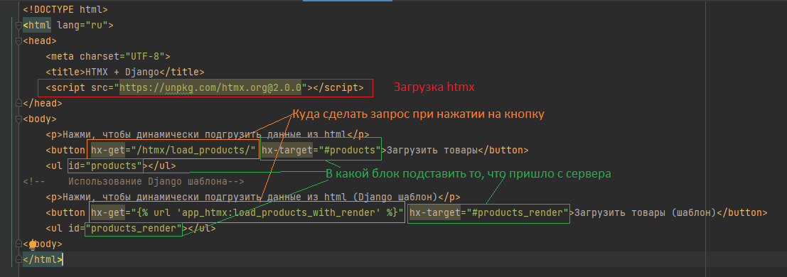

# Использование HTMX 

HTMX – это мощная библиотека, которая позволяет обновлять части HTML-страницы без написания JavaScript. 
В сочетании с Django это делает разработку более удобной и быстрой.

`htmx` (https://htmx.org/) возможно использовать как в чистом виде, так и в качестве надстройки над django в виде
`django-htmx` ( документация https://django-htmx.readthedocs.io/en/latest/)

В папке `_labs/lab7_optional/files` содержится приложение `app_htmx` скопируйте его
и зарегистрируйте в `settings.py` в `INSTALLED_APPS`. 

```python
INSTALLED_APPS = [
    ...,
    'app_htmx',
]
```

В `urls.py` папки project пропишите маршрут

```python
path('htmx/', include('app_htmx.urls')),
```
Пройдите по адресу
http://127.0.0.1:8000/htmx/products/

Появятся 2 кнопки, нажав на которые подгрузятся случайные 4 товара, при повторном нажатии 
появятся другие товары без перезагрузки страницы, ровно тоже самое, что было когда использовали 
бы JS для этого. Можете посмотреть в терминал, что запросы на сервер отправлялись, а страница не перезагружалась.

Чтобы разобраться с этим зайдите в `app_htmx/templates/app_htmx/products.html`, здесь будет важным момент работы с `htmx`



Так загружаются скрипты для работы htmx
```html
<script src="https://unpkg.com/htmx.org@2.0.0"></script>
```
А дальше в атрибутах начинающегося с `hx-...` прописывают взаимодействие с библиотекой

Самая простая связка это HTMX отправит запрос на какой-то адрес, сервер отправит информацию (HTML файл), а HTMX подставит
эту информацию в нужное место.

> Важное замечание HTMX подставляет только данные из пришедшего HTML файла, работать с JSON он не умеет как JS, поэтому при работе 
> с HTMX с сервера возвращается только HTML

В целом в общем случае часто используются эти 4 атрибута:

* `hx-get`: URL-адрес, который элемент будет использовать для отправки запроса AJAX GET.
* `hx-target`: элемент для замены в ответе AJAX, по умолчанию — innerHTML того, кто отправляет запрос AJAX.
* `hx-swap`: как ответ будет заменен относительно цели запроса AJAX, по умолчанию — innerHTML.
* `hx-trigger`: что запускает запрос AJAX, по умолчанию — click.

Другими словами, `hx-get` — это ЧТО, `hx-target` — это КТО, `hx-swap` — это КАК и `hx-trigger` — это КОГДА.

Ниже, более подробно рассмотрим эти атрибуты

#### 1. Атрибуты hx-... для отправления запросов

Самые ходовой атрибут это `hx-get` тут прописывается на какой адрес будет сделан `get` запрос. 

*Пример* 

здесь прописывается отправка `get` запроса на адрес `/htmx/load_products/`
```html
hx-get="/htmx/load_products/"
```

или как пример работы через Django шаблоны

```html
hx-get=""
```

Всего есть 5 возможных типов запросов

* `hx-get` для `GET` запроса
* `hx-post` для `POST` запроса
* `hx-put` для `PUT` запроса
* `hx-patch` для `PATCH` запроса
* `hx-delete` для `DELETE` запроса

#### 2. Атрибут hx-target для указания куда будет подставлен ответ

Ниже приведены коды для различных задач и примеров их использования. Данный код уже 
реализован в `demo_hx_target.html` приложения `app_htmx`. Интерактивно ознакомиться можете по ссылке 

http://127.0.0.1:8000/htmx/hx-target/

Значение атрибута `hx-target` может быть:

* Значение селектора запроса CSS целевого элемента (например `hx-target=#products` вставить в тот блок у которого id=products).

```html
<div id="products">
  <!-- сюда будет вставлен ответ -->
</div>
<div class="box">Обычный блок</div>

<button hx-get="/htmx/load_products/" hx-target="#products" hx-swap="innerHTML">
Загрузить товары
</button>
<!-- Ответ сервера вставится в элемент с id="products" -->
```

* `"this"`, который указывает, что элемент, на котором находится атрибут hx-target, является целевым.

```html
<button hx-get="/htmx/hx-target/load-status/" hx-target="this" hx-swap="outerHTML">
    Проверить статус
</button>
<!-- Ответ заменит саму кнопку -->
```
* `"closest <селектор CSS>"`, который найдет ближайший элемент-предок или себя самого, который соответствует заданному селектору CSS (например, closest tr будет указывать на ближайшую строку таблицы к элементу).

```html
<table>
  <tr> <!-- Ответ заменит всю строку таблицы, содержащую кнопку.-->
    <td>Товар A</td>
      <td>Вся строка заменится, так как она ближайшая к кнопке</td>
      <td>
        <button hx-get="/htmx/hx-target/row-details/" hx-target="closest tr" hx-swap="outerHTML">
          Подробнее
        </button>
      </td>
    </tr>
    <tr>
      <td>Товар Б</td>
      <td>А тут не поменяется</td>
      <td>Кнопки нет</td>
    </tr>
</table>

```

* `"find <селектор CSS>"`, который найдет первый дочерний элемент-потомок, который соответствует заданному селектору CSS.

```html
<div class="details"><!-- Ничего не произойдет--></div>
  <div class="product box" hx-get="/htmx/hx-target/product-details/" hx-target="find .details"
       hx-swap="innerHTML" hx-trigger="click .load-btn">
    <button class="load-btn">Показать детали</button>
      
    <div class="details"><!-- Здесь появится ответ--></div>
    <div class="details"><!-- Ничего не произойдет--></div>
    <div class="details"><!-- Ничего не произойдет--></div>
  </div>
```

* `"next"`, который разрешается в element.nextElementSibling

```html
<button 
  hx-get="/more-info/" 
  hx-target="next" 
  hx-swap="innerHTML">
  Подробнее
</button>

<div> <!-- Ответ попадет в этот элемент, так как он следующий элемент после кнопки.-->
  (пусто)
</div>

<div> 
  (пусто)
</div>
```

* `"next <селектор CSS>"`, который будет сканировать DOM вперед для первого элемента, который соответствует заданному селектору CSS. (например, next .error будет нацелен на ближайший следующий элемент-брат с классом ошибки)

```html
<!-- Ответ от сервера попадёт в ближайший следующий .error-блок. -->
<form hx-post="/htmx/hx-target/validate/" hx-target="next .error" hx-swap="innerHTML">
    <input name="email" placeholder="Введите email" />
    <button type="submit">Проверить</button>
  </form>

  <div class="error box"><!-- Но не здесь --></div>
  <div class="error box"><!-- Здесь будет ответ --></div>
  <div class="error box"><!-- Но не здесь --></div>
```

* `"previous"`, который преобразуется в element.previousElementSibling

```html
<div class="input box"><!-- Здесь не будет ответа --></div>
<div class="output box"><!-- Здесь будет ответ --></div>
<button
hx-get="/htmx/hx-target/result/"
hx-target="previous"
hx-swap="innerHTML">
Обновить
</button>
```

* `"previous <селектор CSS>"`, который будет сканировать DOM в обратном направлении для первого элемента, соответствующего заданному селектору CSS. (например, previous .error будет нацелен на ближайший предыдущий элемент-брат с классом ошибки)

```html
<!-- HTMX найдёт предыдущий .msg внутри родительского элемента и вставит туда ответ -->
<div class="msg box">блок .msg</div>
<div class="tmp box">блок .tmp</div>
<div class="msg box">блок .msg</div>
<div class="tmp box">блок .tmp</div>
<button hx-get="/htmx/hx-target/note/" hx-target="previous .msg" hx-swap="innerHTML">
Показать сообщение
</button>
<div class="tmp box">блок .tmp</div>
<div class="msg box">блок .msg</div>

```

#### 3. Атрибут hx-swap для указания куда будет подставлен ответ

Атрибут `hx-swap` позволяет указать, как ответ будет заменен относительно цели (`hx-target`) запроса AJAX. 
Если вы не укажете этот параметр, по умолчанию будет `innerHTML`.

Ниже приведены коды для различных задач и примеров их использования. Данный код уже 
реализован в `demo_hx_swap.html` приложения `app_htmx`. Интерактивно ознакомиться можете по ссылке

http://127.0.0.1:8000/htmx/hx-swap/

Возможные значения этого атрибута:

* `"innerHTML"` — заменяет внутренний `html` целевого элемента

```html
<div class="demo-block">
  <div class="response" id="inner"><!--Данный текст заменится на ответ--></div>
  <button
    hx-get="/htmx/hx-swap/inner"
    hx-target="#inner"
    hx-swap="innerHTML">
    innerHTML
  </button>
</div>
```

* `"outerHTML"` — заменяет весь целевой элемент ответом

```html
<div class="demo-block">
  <div class="response" id="outer"><!--Весь этот блок div class="response" id="outer" полностью заменится--></div>
  <button
    hx-get="/htmx/hx-swap/outer"
    hx-target="#outer"
    hx-swap="outerHTML">
    outerHTML
  </button>
</div>
```

* `"textContent"` — заменяет текстовое содержимое целевого элемента без анализа ответа как HTML

```html
<div class="demo-block">
  <div class="response" id="text"><b>Жирный текст</b></div>
  <button
    hx-get="/htmx/hx-swap/text"
    hx-target="#text"
    hx-swap="textContent">
    textContent
  </button>
</div>
```

* `"beforebegin"` — вставляет ответ перед целевым элементом

```html
<div class="demo-block">
  <div class="response" id="before">Контейнер</div>
  <button
    hx-get="/htmx/hx-swap/before"
    hx-target="#before"
    hx-swap="beforebegin">
    beforebegin
  </button>
</div>
```

* `"afterbegin"` — вставляет ответ перед первым дочерним элементом целевого элемента

```html
<div class="demo-block">
  <div class="response" id="after-begin">Вставка будет первой внутри</div>
  <button
    hx-get="/htmx/hx-swap/after-begin"
    hx-target="#after-begin"
    hx-swap="afterbegin">
    afterbegin
  </button>
</div>
```

* `"beforeend"` — вставляет ответ после последнего дочернего элемента целевого элемента

```html
<div class="demo-block">
  <div class="response" id="before-end">Вставка будет последней внутри</div>
  <button
    hx-get="/htmx/hx-swap/before-end"
    hx-target="#before-end"
    hx-swap="beforeend">
    beforeend
  </button>
</div>
```

* `"afterend"` — вставляет ответ после целевого элемента

```html
<div class="demo-block">
  <div class="response" id="after">Элемент</div>
  <button
    hx-get="/htmx/hx-swap/after"
    hx-target="#after"
    hx-swap="afterend">
    afterend
  </button>
</div>
```

* `"delete"` — удаляет целевой элемент независимо от ответа

```html
<div class="demo-block">
  <div class="response" id="delete">Этот элемент будет удалён</div>
  <button
    hx-get="/htmx/hx-swap/delete"
    hx-target="#delete"
    hx-swap="delete">
    delete
  </button>
</div>
```

* `"none"` — не добавляет содержимое из ответа (внешние элементы все равно будут обработаны).

```html
<div class="demo-block">
  <div class="response" id="none">Ничего не изменится</div>
  <button
    hx-get="/htmx/hx-swap/none"
    hx-target="#none"
    hx-swap="none">
    none
  </button>
</div>
```

#### 4. Атрибут hx-trigger для указания куда будет подставлен ответ

Атрибут `hx-trigger` позволяет указать, каком действии и когда будет выполняться условие. По умолчанию это
`click`, т.е. при нажатии мышкой или нажатии `Enter`.

Ниже приведены коды для различных задач и примеров их использования. Данный код уже 
реализован в `demo_hx_trigger.html` приложения `app_htmx`. Интерактивно ознакомиться можете по ссылке

http://127.0.0.1:8000/htmx/hx-swap/


🖱️ События мыши
Событие	Описание
click	Клик мыши или Enter на кнопке
dblclick	Двойной клик
mousedown	Нажатие кнопки мыши
mouseup	Отпускание кнопки мыши
mouseover	Наведение курсора
mouseout	Уход курсора
mousemove	Движение мыши
contextmenu	Правая кнопка мыши

🧠 События клавиатуры
Событие	Описание
keydown	Нажатие клавиши
keypress	Нажатие символьной клавиши (устарело)
keyup	Отпускание клавиши

⌨️ События ввода / формы
Событие	Описание
input	Изменение значения поля ввода
change	Изменение, подтверждённое пользователем (после blur)
focus	Получение фокуса
blur	Потеря фокуса
submit	Отправка формы
reset	Сброс формы

📦 События загрузки
Событие	Описание
load	Когда элемент (или страница) загружен
unload	При уходе со страницы (устарело)
error	Ошибка загрузки изображения или скрипта
resize	Изменение размеров окна
scroll	Прокрутка

📅 События фокуса (формы)
Событие	Описание
focusin	Когда потомок получает фокус
focusout	Когда потомок теряет фокус

📲 События клипа и буфера обмена
Событие	Описание
copy	Копирование
cut	Вырезание
paste	Вставка

🔄 События Drag & Drop
Событие	Описание
drag	Перетаскивание
dragstart	Начало перетаскивания
dragend	Завершение
dragenter	Наведение на цель
dragover	Перетаскивание над элементом
dragleave	Покидание элемента
drop	Сброс


WebSocket  (Django Channels https://django.fun/docs/channels/3/tutorial/)
Можно сделать чат на главной странице появляющаяся вкладка


Пагинация

